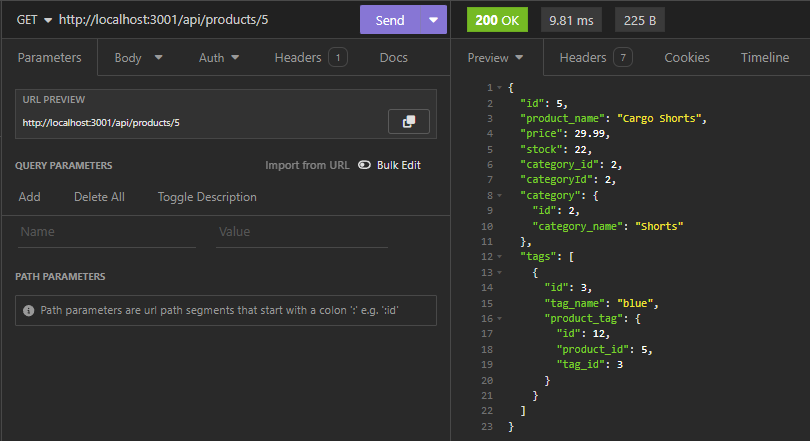
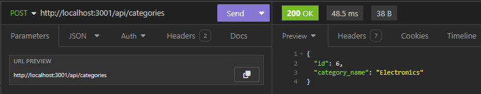
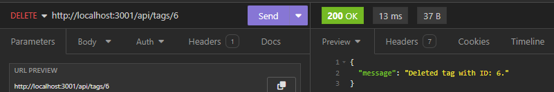

# E-Commerce Backend

## Table of Contents
- [Description](#description)
- [Features](#features)
- [Demo](#demo)
- [Installation](#installation)
- [Screenshots](#screenshots)
- [Credits](#credits)
- [License](#license)

## Description

This application is a back end for an e-commerce site. It uses a custom Express.js API and Sequelize to allow users or developers to use CRUD interactions in a MySQL database.

### Database Models

The database contains the following four models, including the requirements listed for each model:

* `Category`
  * `id`
    * Integer.
    * Doesn't allow null values.
    * Set as primary key.
    * Uses auto increment.
  * `category_name`
    * String.
    * Doesn't allow null values.

* `Product`
  * `id`
    * Integer.
    * Doesn't allow null values.
    * Set as primary key.
    * Uses auto increment.
  * `product_name`
    * String.
    * Doesn't allow null values.
  * `price`
    * Decimal.
    * Doesn't allow null values.
    * Validates that the value is a decimal.
  * `stock`
    * Integer.
    * Doesn't allow null values.
    * Set a default value of `10`.
    * Validates that the value is numeric.
  * `category_id`
    * Integer.
    * References the `Category` model's `id`.

* `Tag`
  * `id`
    * Integer.
    * Doesn't allow null values.
    * Set as primary key.
    * Uses auto increment.
  * `tag_name`
    * String.

* `ProductTag`
  * `id`
    * Integer.
    * Doesn't allow null values.
    * Set as primary key.
    * Uses auto increment.
  * `product_id`
    * Integer.
    * References the `Product` model's `id`.
  * `tag_id`
    * Integer.
    * References the `Tag` model's `id`.

### Associations

* `Product` belongs to `Category`, and `Category` has many `Product` models, as a category can have multiple products but a product can only belong to one category.

* `Product` belongs to many `Tag` models, and `Tag` belongs to many `Product` models. Allows products to have multiple tags and tags to have many products through the `ProductTag` model.

## Features

* [Node.js](https://nodejs.org/en) to execute JavaScript in CLI or *outside* of web browser.
* [Express.js](https://expressjs.com/) to implement back-end web framework for routing, middleware, and API.
* [Insomnia](https://insomnia.rest/) to design, debug, and test API.
* [Dotenv](https://www.npmjs.com/package/dotenv) to store and load environment variables from a *.env* file into process.env.
* [MySQL2](https://www.npmjs.com/package/mysql2) to query database. Compatible with Node.js and focuses on performance.
* [Sequelize](https://www.npmjs.com/package/sequelize) to create Sequelize models and sync them to the MySQL database.

## Demo

Please view the video demo: [https://drive.google.com/file/d/1ZoKlFr4MOnsPZQj_oFdeH1t8K8oEYG3s/view?usp=sharing](https://drive.google.com/file/d/1ZoKlFr4MOnsPZQj_oFdeH1t8K8oEYG3s/view?usp=sharing)

## Installation

1. Download and install [Node.js](https://nodejs.org/en).
2. Download and install [MySQL](https://dev.mysql.com/downloads/installer/).
3. Download repo files by [cloning the repo](https://docs.github.com/en/repositories/creating-and-managing-repositories/cloning-a-repository#cloning-a-repository) or [downloading the ZIP folder](https://github.com/apri1mayrain/e-commerce-backend/archive/refs/heads/main.zip). If downloading ZIP folder, please be sure to extract the folder.
4. Open your preferred command line interface.
5. Navigate to the file directory containing the repo.
6. Log into MySQL and [source](https://dev.mysql.com/doc/refman/8.0/en/mysql-batch-commands.html) the *db/schema.sql* file.
7. Enter your database information in the *.env* file. You may only need to enter your mySQL password.
8. Install the NPMs with command: `npm install`
9. Seed the database: `npm run seed`
10. Start the app with command: `npm start`
11. To test API, install [Insomnia](https://insomnia.rest/).

## Screenshots

* GET product:

* POST category:

* DELETE tag:

## Credits

* Starter code: https://github.com/coding-boot-camp/fantastic-umbrella
* Researched Stack Overflow forums and other coding resources.

## License

MIT License - Copyright © 2024 apri1mayrain

[(Go back to top)](#e-commerce-backend)